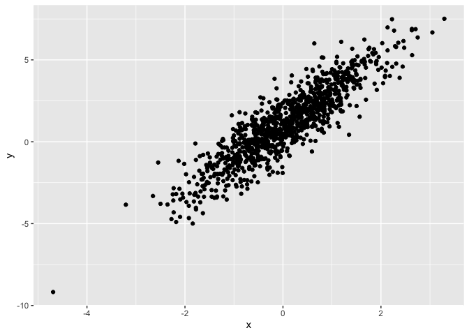

Simple document
================

I’m an R Markdown document!

# Section 1

Here’s a **code chunk** that samples from a *normal distribution*:

``` r
samp = rnorm(100)
length(samp)
```

    ## [1] 100

# Section 2

I can take the mean of the sample, too! The mean is 0.15.

# Section 3

This is going to make a plot! First I generate a dataframe, then use
`ggplot` to make a scatterplot.

<!-- -->
